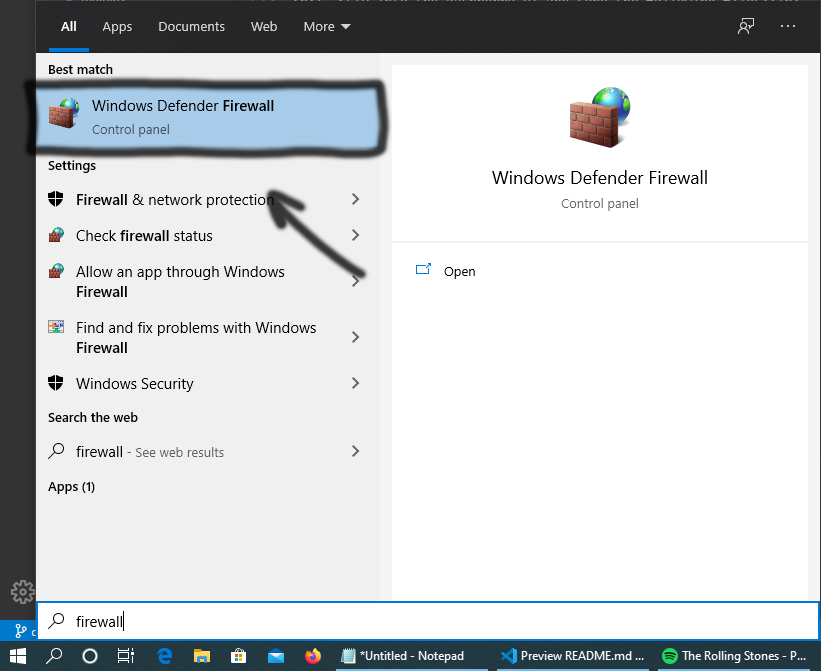
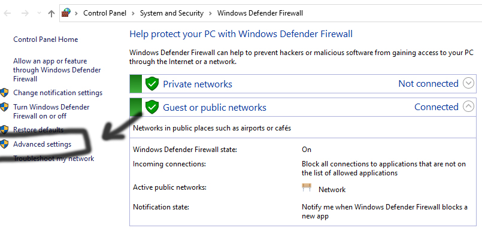
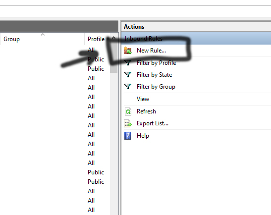
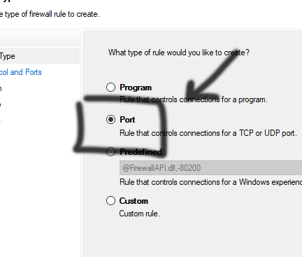
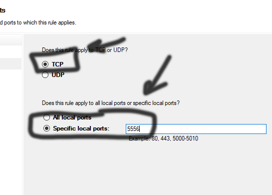

# RGB Audio Peak Visuliser
<p>A python application that loopbacks the playback output to create a visualiser with RGB strips.</p>

<h1>Requirements</h1>
<p>- Host Computer</p>
<p>- Listener Computer (Raspberry Pi/Audino)</p>
<pre><a href="https://www.raspberrypi.org/products/">https://www.raspberrypi.org/products/</a></pre>
<p>- Codeable RGB strip
<p>- Python-3</p>
<pre><a href="https://www.python.org/ftp/python/3.8.3/python-3.8.3.exe">https://www.python.org/ftp/python/3.8.3/python-3.8.3.exe</a></pre>
<h1>Usage</h1>
<h3>Host</h3>
<p>1. Clone the repo or download as zip and extract the files.</p>
```
bash
git clone https://github.com/mcrrobinson/RGB-audio-peak-visualiser.git
```
<p>2. Install depdencenies.</p>
```
bash
pip install -r requirements.txt
```
<p>3. Adjust the configuration as you wish.</p>
```
yaml
# Regards the output stream.
stream:

  # Recorder information.
  defaultframes: 512

  # Determined by the output Hz by your chosen sample rate.
  CHUNK: 2048

...
```
<p>4. Open a terminal and run the application.</p>
<h6>Windows</h6>
``` bash
python main.py
```
<h6>Linux</h6>
``` bash
python ./main.py
```
<p>5. If you did everything correctly you should see the following.</p>
``` python
RPC Stream Information:

        RPC Stream State: Active
        Host IP Address: *your_ip_address*
        Loopback Device: Speakers (USB Audio CODEC )
```
<p>6. Type in Windows Firewall</p>

<p>7. Goto Advanced Settings</p>

<p>8. Create new rule.</p>

<p>9. Change to port.</p>

<p>10. Make sure TCP is highlighted and change to Specific Local Ports, input the port enabled in the configuration. The default is "5556".</p>

<p>11. Then keep clicking next until the diaglog box is closed. Time to setup the client.</p>
<h3>Client</h3>
<h5>Raspberry Pi Installation</h5>
<p>1. SFTP into the Raspberry Pi and copy the following files:</p>
```
listener.py
listener.yaml
requirements.txt
```
<p>2. Install depdencenies.</p>
```bash
pip install -r requirements.txt
```
<p>3. Adjust the configuration as you wish.</p>
```yaml
# Regards the output stream.
stream:

  # Recorder information.
  defaultframes: 512

  # Determined by the output Hz by your chosen sample rate.
  CHUNK: 2048

...
```
<p>4. Open a terminal and run the application.</p>
<h6>Windows</h6>
```bash
python main.py
```
<h6>Linux</h6>
```bash
python ./main.py
```
<h3>Releases</h3>
<p><a id="raw-url" href="https://raw.githubusercontent.com/mcrrobinson/RGB-audio-peak-visualiser/master/main.py">Download Host Zip</a></p>
<p><a id="raw-url" href="https://raw.githubusercontent.com/mcrrobinson/RGB-audio-peak-visualiser/master/listener.py">Download Client Zip</a></p>
<h3>FAQ</h3>
<p>1. I setup everything correctly but I am not receiving anything on the Raspberry Pi, why?</p>
<p>Make sure you have tested to see if you can ping the host with the port with the command below, change the IP and Port to what you are using in the configuration files.</p>
```bash
ping *host_ip* -p *host_port*
```
<p>If you are unable to ping the client, modify your new rule to allow "Any" protocol on that port to see if that improves it.</p>
<h3>Plans</h3>
<p>I plan to release a Audino variation of this software.</p>
